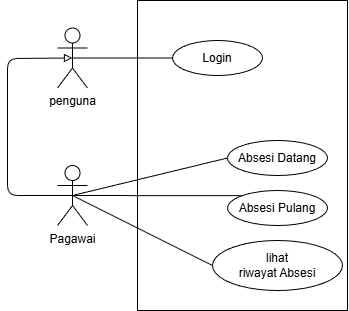
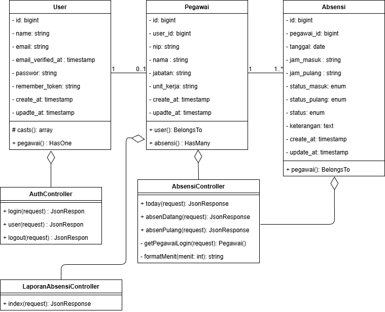
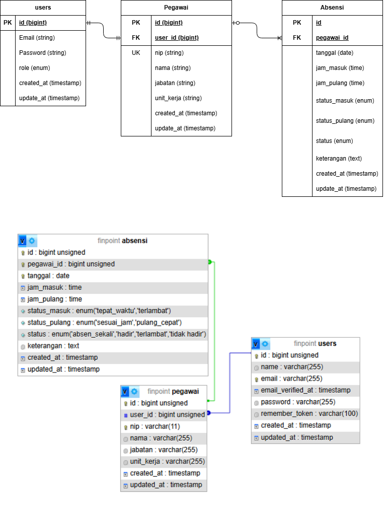

# Sistem Absensi Pegawai - RPL

## Deskripsi Proyek

**Sistem Absensi Pegawai** adalah aplikasi web yang dikembangkan untuk mendukung proses pencatatan kehadiran pegawai secara digital. Sistem ini dirancang sebagai proyek **Rekayasa Perangkat Lunak (RPL)** dengan menerapkan tahapan analisis kebutuhan, perancangan sistem, implementasi, pengujian, dan dokumentasi.

Aplikasi ini memiliki fitur utama seperti autentikasi pengguna, absensi datang, absensi pulang, melihat daftar pegawai, serta pengelolaan riwayat absensi. Sistem dikembangkan menggunakan arsitektur **frontend dan backend terpisah**, dengan Vue.js sebagai frontend dan Laravel sebagai backend API.

---

## Tujuan Pengembangan

Tujuan pengembangan sistem ini adalah:

1. Membangun aplikasi absensi pegawai berbasis web.
2. Menerapkan konsep Rekayasa Perangkat Lunak dalam proses pengembangan sistem.
3. Menyediakan fitur pencatatan absensi datang dan absensi pulang.
4. Menyediakan fitur pengelolaan data pegawai.
5. Menyediakan fitur riwayat absensi untuk kebutuhan monitoring.
6. Menghasilkan dokumentasi perangkat lunak yang sistematis dan mudah dipahami.

---

## Ruang Lingkup Sistem

Ruang lingkup sistem mencakup:

- Login pengguna.
- Logout pengguna.
- Absensi datang.
- Absensi pulang.
- Melihat riwayat absensi.
- Pengelolaan data pegawai.

Sistem ini difokuskan pada kebutuhan dasar absensi pegawai dan dapat dikembangkan lebih lanjut dengan fitur tambahan.

---

## Teknologi yang Digunakan

### Frontend

- Vue.js 3
- Vite
- JavaScript
- Axios
- HTML
- CSS

### Backend

- PHP 8.2
- Laravel
- REST API

### Database

- MySQL 8.0

### Tools Pendukung

- Docker
- Docker Compose
- phpMyAdmin
- Git
- GitHub
- Draw.io untuk dokumentasi diagram

## Aktor Sistem

Berdasarkan use case diagram, aktor utama dalam sistem adalah:

| Aktor   | Deskripsi                                                                  |
| ------- | -------------------------------------------------------------------------- |
| Pegawai | Pengguna yang melakukan login, logout, absensi datang, dan absensi pulang. |

---





## Alur Kerja Sistem

### Alur Login

1. Pengguna membuka halaman login.
2. Pengguna memasukkan email dan password.
3. Sistem mengirim data login ke backend.
4. Backend memvalidasi kredensial.
5. Jika valid, sistem memberikan akses ke dashboard.
6. Jika tidak valid, sistem menampilkan pesan kesalahan.

### Alur Absensi Datang

1. Pegawai login ke sistem.
2. Pegawai membuka halaman absensi.
3. Pegawai menekan tombol absensi datang.
4. Sistem mencatat tanggal dan waktu kedatangan.
5. Data absensi disimpan ke database.
6. Sistem menampilkan status berhasil.

### Alur Absensi Pulang

1. Pegawai login ke sistem.
2. Pegawai membuka halaman absensi.
3. Pegawai menekan tombol absensi pulang.
4. Sistem mencatat waktu pulang.
5. Sistem memperbarui data absensi pada tanggal yang sama.
6. Sistem menampilkan status berhasil.

### Alur Melihat Riwayat Absensi

1. Pegawa membuka halaman riwayat absensi.
2. Sistem mengambil data riwayat absensi dari backend.
3. Sistem menampilkan riwayat absensi dalam bentuk tabel.

---

---

## Instalasi Menggunakan Docker

Pastikan Docker dan Docker Compose sudah terpasang.

Jalankan perintah berikut dari root project:

```bash
docker compose up -d --build
```

Service utama yang digunakan:

| Service    | Fungsi              | Port |
| ---------- | ------------------- | ---- |
| backend    | Laravel backend API | 9000 |
| web        | Vue.js frontend     | 5173 |
| db         | MySQL database      | 3306 |
| phpmyadmin | Database management | 8082 |

---

## Manajemen Branch Git

Branch yang disarankan:

```bash
main        # branch utama atau rilis stabil
dev         # branch pengembangan
feature/*   # branch fitur baru
fix/*       # branch perbaikan bug
```

Contoh pesan commit:

```bash
feat: add employee attendance feature
feat: add employee list page
fix: resolve login validation issue
docs: add use case and class diagram documentation
refactor: improve frontend folder structure
test: add attendance feature test scenario
```

---

## Kesimpulan

Sistem Absensi Pegawai merupakan aplikasi web yang dirancang untuk membantu proses pencatatan kehadiran pegawai secara digital. Sistem ini menerapkan konsep Rekayasa Perangkat Lunak melalui analisis kebutuhan, perancangan use case, perancangan class diagram, implementasi frontend dan backend, serta pengujian sistem.

Dengan struktur frontend dan backend yang terpisah, sistem ini lebih mudah dikembangkan, diuji, dan dipelihara. Proyek ini juga dapat diperluas menjadi sistem absensi yang lebih lengkap dengan fitur laporan, validasi lokasi, QR Code, dan dashboard analitik.
